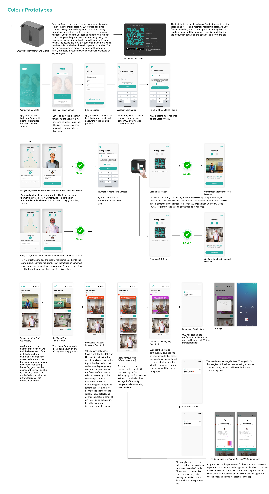

# Usafe
**HỆ THỐNG PHÂN TÍCH THEO DÕI HÀNH VI BẤT THƯỜNG HỖ TRỢ NGƯỜI CAO TUỔI SỐNG AN TOÀN Ở NHÀ MỘT MÌNH**

Môn học: Tương tác người máy INT2041 40

## Các thành viên của nhóm:
Bùi Khánh Huyền - 19021307

Nguyễn Minh Quy - 20021418

Nguyễn Đức Anh Quân - 20021416

Lê Đức Mai Hoàng - 20020014
## Mô tả về ứng dụng: 
Ứng dụng di động giúp hỗ trợ chăm sóc và theo dõi  hoạt động của người cao tuổi sống độc lập. Ứng dụng gồm 2 nhóm chức năng chính: Nhóm chức năng thông thường và nhóm chức năng trong trường hợp đặc biệt.

Nhóm chức năng thông thường bao gồm :đăng nhập và đăng kí tài khoản, thêm/xóa người được chăm sóc, thêm/xóa thiết bị theo dõi được kết nối với tài khoản, theo dõi trực tiếp ở hai chế độ: real body và linear figure, gửi báo cáo các hoạt động trong ngày của người được chăm sóc cho người chăm sóc.

Nhóm chức năng trong trường hợp đặc biệt bao gồm: gửi thông báo cho người chăm sóc khi nhận thấy người được chăm sóc có hoạt động bất thường hoặc ở trong tình huống nguy cấp, tự động liên lạc với đường dây hỗ trợ y tế nếu không có sự can thiệp của người chăm sóc trong trường hợp khẩn cấp.
## Demo
[HMI Project - Usafe: Supporting system for Elderly](https://bit.ly/Project-demo)
## Source
[Usafe - Supporting system for Elderly](https://www.figma.com/file/HOqVYhx0JEU41jiPGv7UgA/Usafe---Supporting-system-for-Elderly?node-id=0%3A1&t=nWsz2dK23KXgw6aI-1)
## Workflow

